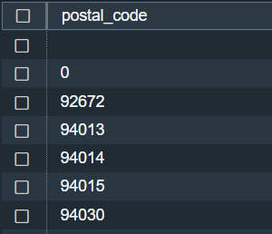
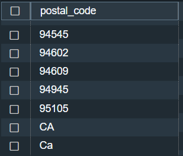

# San Francisco Department of Public Health Inspection Data for 2013 - 2016

October 7, 2023

By:  Annie V Lam - Kura Labs

## Dataset

[San Francisco Department of Public Health Inspection Data for 2013 - 2016](https://c4databucket.s3.amazonaws.com/sanFranciscoRestaurantScores.zip)

There are three files uploaded to AWS S3 bucket:  businesses.csv, inspections.csv, and violations.csv.  The three sets of data were then imported to AWS Redshift inspections Dataabase the three files were uploaded as tables called businesses_tbl, inspections, and violations respectively.

## Cleaning the Inspection Dataset

**Add a new column field inspection_date to be formatted later**

-  ALTER TABLE inspections 
-  ADD COLUMN inspection_date DATE;

**Format inspection_date field to a date format**
-  UPDATE inspections
-  SET inspection_date = TO_DATE(date, 'YYYYMMDD');

UPDATE inspections SET inspection_date = TO_DATE(date, 'YYYYMMDD');

**How many inspection types are there?**

-  SELECT DISTINCT(type)
-  FROM inspections;

**Result:**

Complaint Reinspection/Followup	 score all NULL, New Construction, New Ownership, Foodborne Illness Investigation, Special Event, Multi-agency Investigation, Routine - Scheduled, Routine - Unscheduled, Reinspection/Followup, Non-inspection site visit, Complaint, Structural Inspection, Administrative or Document Review

**How many of the inspection types have scores?**

-  SELECT DISTINCT(type)
-  FROM inspections
-  WHERE score is not NULL;

**Result:**

New Ownership, Routine - Unscheduled, Reinspection/Followup

**Explore each of the three data types where the score is not NULL:**

-  SELECT *
-  FROM inspections
-  WHERE type = 'New Ownership' and score is not NULL
-  LIMIT 100;

**New Ownership Result:**

For New Ownership, only business id 87440 has a score for Aug 1, 2016.  Most likely this is an error where there should be no score or it was miscategorized as "New Ownership".  We would need to send this info to the business unit to verify.  

-  SELECT *
-  FROM inspections
-  WHERE type = 'Reinspection/Followup' and score is not NULL
-  LIMIT 100;

**Reinspection/Followup Result:**

For Reinspection/Followup, only business id 597 has a score for March 10, 2016.  Most likely this is an error where it was miss categorized as "New Ownership".  We would need to send this info to the business unit to verify. 

-  SELECT *
-  FROM inspections
-  WHERE type = 'Routine - Unscheduled' and score is not NULL
-  LIMIT 100;

**Routine - Unscheduled Result:**
All of the scores are from Routine - Unscheduled

## Exploring the Inspection Dataset for duplicate scores

**Create a key as save the query to a view**

-  CREATE VIEW inspection_view_0 AS
-  SELECT date+'-'+business_id as inspection_id,*
-  FROM inspections
-  WHERE score is not NULL AND type = 'Routine - Unscheduled';

**Find the duplicates and save them to a view**

-  CREATE VIEW duplicate_inspections AS
-  SELECT inspection_id, count(inspection_id)
-  FROM inspection_view_0
-  GROUP BY inspection_id
-  HAVING count(inspection_id) > 1;

**Explore the duplicate transactions**

-  SELECT i.* 
-  FROM duplicate_inspections d
-  LEFT JOIN inspection_view_0 i
-  ON d.inspection_id = i.inspection_id

**Result:**

There is a duplicate for business_id 64859 on September 24, 2015.  It received two scores:  93 and 96.  Per the business unit, the correct score is 96.

### Creating a Clean Inspection dataset

-  CREATE VIEW inspection_score_view AS
-  SELECT date+'-'+business_id as inspection_id, business_id , type as Type, inspection_date, score
-  FROM inspections
-  WHERE type = 'Routine - Unscheduled' AND score is not NULL AND date+business_id+CONVERT(varchar(10),score) <> '201509246485991';

## Cleaning the Business Dataset

**ADD KEY to violations**

-  CREATE VIEW business_violations AS
-  SELECT SUBSTRING(date, 1, 4)+SUBSTRING(date, 6, 2)+SUBSTRING(date, 9, 2)+'-'+business_id+'-'+violationtypeid AS violation_id, *
-  FROM violations;

**VERIFY THERE ARE NO DUPLICATES in Violations**

-  SELECT violation_id, COUNT(violation_id) AS count_of_violation_id
-  FROM business_violations
-  GROUP BY violation_id
-  HAVING COUNT(violation_id) > 1;
  
**CREATE A VIOLATION_VIEW WITH NO DUPLICATES**

-  CREATE VIEW violation_view AS
-  WITH violations_tbl AS
-  (SELECT *, ROW_NUMBER()OVER(PARTITION BY violation_id ORDER BY violation_id) AS rownumber
-  FROM business_violations)
-  SELECT * FROM violations_tbl WHERE rownumber ='1' ORDER BY violation_id

 ## Cleaning the Violation Dataset

**CREATE VIEW for Duplicate Businesses**

-  CREATE VIEW duplicate_businesses AS
-  WITH businesses_x AS
-  (SELECT *, ROW_NUMBER()OVER(PARTITION BY business_id ORDER BY business_id) AS rownumber
-  FROM businesses_tbl)
-  SELECT * FROM businesses_x WHERE rownumber >'1' ORDER BY business_id

**Explore the duplicate business IDs**

-  SELECT b.* 
-  FROM duplicate_businesses d
-  LEFT JOIN businesses_tbl b
-  ON d.business_id = b.business_id;

**View the distinct postal code**

-  SELECT DISTINCT(postal_code)
-  FROM businesses_tbl;

**Result:**

Most of the zips start with 94, there is one that starts with 92, some of the zip have the add-on 4 digit codes, there are null values, the zip that has a value "0", and the ones with the California state abbreviation in the postal_code.  Looked up zip code 92675 and it is not a San Francisco zip code, will send that to the business unit to verify.

**CLEAN ZIP**

-  CREATE VIEW businesses_view_0 AS
-  SELECT business_id, name, address, city, postal_code,
-  CASE
-  WHEN LEN(postal_code) < 5 THEN NULL
-  WHEN postal_code = '92672' THEN NULL
-  WHEN postal_code = '94609' THEN NULL
-  ELSE SUBSTRING(postal_code, 1, 5)
-  END AS zip
-  FROM businesses_tbl
-  ORDER BY postal_code DESC;

**CREATE A BUSINESSES_VIEW WITH NO DUPLICATES**

-  CREATE VIEW businesses_view AS
-  WITH business AS
-  (SELECT *, ROW_NUMBER()OVER(PARTITION BY business_id ORDER BY business_id) AS rownumber
-  FROM businesses_view_0)
-  SELECT * FROM business WHERE rownumber ='1' ORDER BY business_id

**VERIFY THERE ARE NO DUPLICATES**

-  SELECT business_id, COUNT(business_id) AS count_of_business_id
-  FROM businesses_view
-  GROUP BY business_id
-  HAVING COUNT(business_id) > 1;

## REPORTS TO BUSINESS UNIT to VERIFY DATA

**Business in violation report not found in businesses list**

-  CREATE VIEW violation_business_not_in_businesses_tbl AS
-  SELECT v.business_id, b.name
-  FROM violation_view v
-  LEFT JOIN businesses_view b
-  ON v.business_id = b.business_id
-  GROUP BY v.business_id, b.name
-  HAVING b.name is NULL;

  [Business in violation report not found in businesses list](violation_business_not_in_businesses_tbl.csv)

**Business in inspection report not found in businesses list**

-  CREATE VIEW inspection_business_not_in_businesses_tbl AS
-  SELECT s.business_id, b.name
-  FROM inspection_score_view s
-  LEFT JOIN businesses_view b
-  ON s.business_id = b.business_id
-  GROUP BY s.business_id, b.name
-  HAVING b.name is NULL;

[Business in inspection report not found in businesses list](inspection_business_not_in_businesses_tbl.csv)

**Incorrect Postal code List**

-  CREATE VIEW busiensses_with_incorrect_zip AS
-  SELECT *
-  FROM businesses_view_0
-  WHERE zip is NULL;

[Incorrect Postal code List](busiensses_with_incorrect_zip.csv)

**Note:  If we have access to a database with all San Francisco addresses or longitude and latitude coordinates with their postal codes, we will be able to query that database and find the corresponding postal codes.**

## Analysis of the data in the tables:

**1) What is the distribution of "risk_category violations" per zip code? (per zip, what are the numbers/percentages of high/low/moderate risk violations)**

-  CREATE VIEW q1_distribution_of_risk AS
-  SELECT b.zip, v.risk_category, 
-  COUNT(*) AS risk_count,
-  ROUND((COUNT(*) * 1.0 / SUM(COUNT(*)) OVER (PARTITION BY b.zip))*100, 2) as risk_percentage
-  FROM violation_view v
-  LEFT JOIN businesses_view b
-  ON v.business_id = b.business_id
-  GROUP by v.risk_category, b.zip
-  ORDER BY b.zip, v.risk_category;

**2) What is the average score of restaurants in the different zip codes by year?**

-  CREATE VIEW q2_avg_score_by_year_zip AS
-  SELECT DATE_PART_YEAR(s.inspection_date) as year, b.zip, AVG(s.score) as average_score
-  FROM inspection_score_view s
-  LEFT JOIN businesses_view b
-  ON s.business_id = b.business_id
-  GROUP BY DATE_PART_YEAR(s.inspection_date), b.zip
-  HAVING zip is not NULL
-  ORDER BY b.zip, year;

**3) Which are the top 10 restaurants that have the most "High Risk" violations?  What violations are they?**

-  CREATE VIEW q3a_highest_risk_10_restaurants AS
-  SELECT v.business_id, b.name, v.risk_category, count(v.risk_category) AS high_risk_count
-  FROM violation_view v
-  LEFT JOIN businesses_view b
-  ON v.business_id = b.business_id
-  GROUP BY v.business_id, b.name, v.risk_category
-  HAVING v.risk_category = 'High Risk' --AND high_risk_count > 8
-  ORDER BY high_risk_count DESC, v.business_id
-  LIMIT 10;

